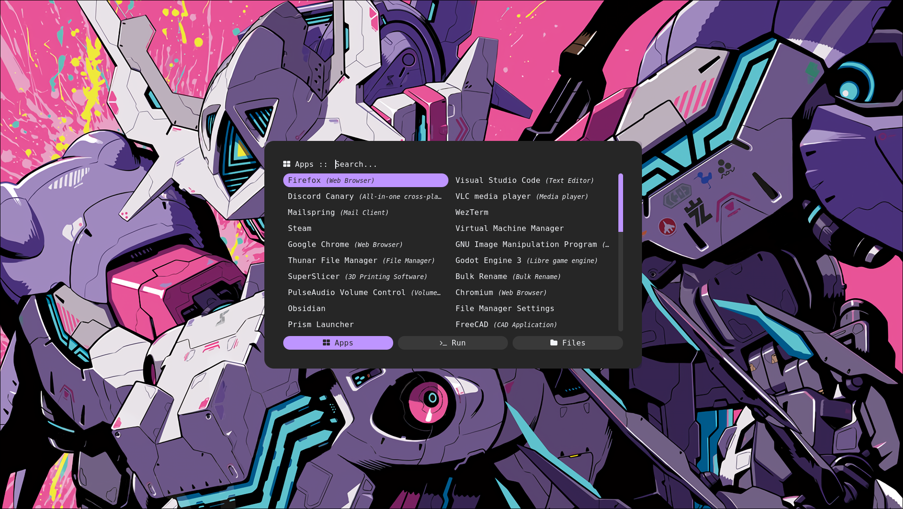
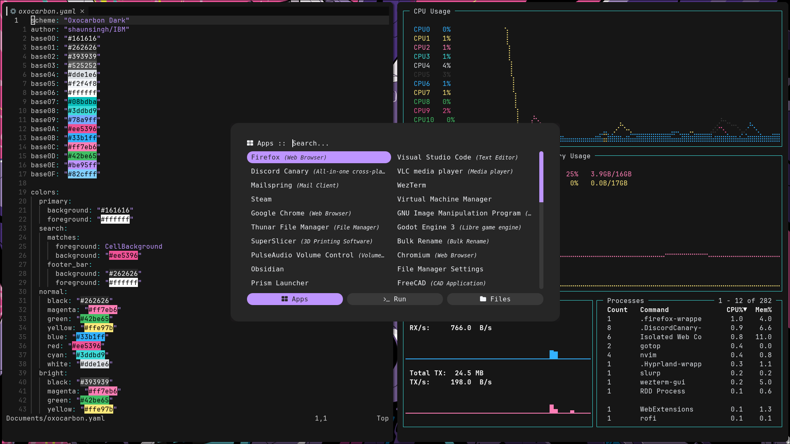

<div align="center">

# oxocarbon-rofi<app-name>

</div>

<div align="center">

[](https://github.com/nyoom-engineering/oxocarbon/stargazers)
[](https://github.com/nyoom-engineering/oxocarbon/issues)
[](https://www.gnu.org/licenses/gpl-3.0.en.html)


</div>

Oxocarbon is a set of community ports of IBM's carbon color palette and design philosophy to various applications and tooling.

## Showcase




## Install

Clone the repository, and then copy the config.rasi file into ~/.config/rofi.

```sh
git clone https://github.com/BattleCh1cken/oxocarbon-rofi.git
cd oxocarbon-rofi
mkdir -p ~/.config/rofi
cp config.rasi ~/.config/rofi
```

## License

The project is licensed under the GPL 3.0 license

## Credits

- [Adi1090x](https://github.com/adi1090x/rofi)
